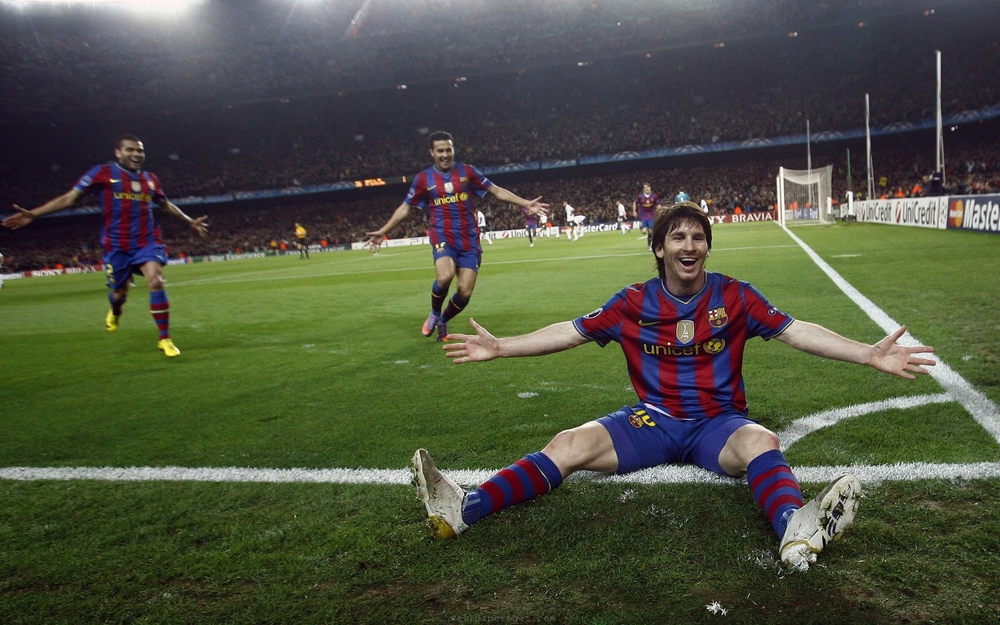

# Css-basic-of-card-design
This is my design during learning phase.
<!DOCTYPE html>
<html lang="en">
<head>
    <meta charset="UTF-8">
    <meta name="viewport" content="width=device-width, initial-scale=1.0">
    <title>Card</title>
    
</head>
<body>
    

        

         
        

        

            football
            soccer
        

        

            <h2>Lionel Messi</h2>
            

                The god of football lionel messi here we go Lorem ipsum, dolor sit amet consectetur adipisicing elit. Quis similique libero eius, veniam voluptate aspernatur inventore perspiciatis quo accusamus asperiores. Recusandae excepturi ratione officiis eveniet ex tempora optio vel repellendus ad dolorem, odit, iste animi unde labore quasi sed ullam beatae et. Aliquam, natus quisquam.
            

        

        

            <button>Read More</button>
        

    

    

        

         
        

        

            football
            soccer
        

        

            <h2>Lionel Messi</h2>
            

                The god of football lionel messi here we go Lorem ipsum, dolor sit amet consectetur adipisicing elit. Quis similique libero eius, veniam voluptate aspernatur inventore perspiciatis quo accusamus asperiores. Recusandae excepturi ratione officiis eveniet ex tempora optio vel repellendus ad dolorem, odit, iste animi unde labore quasi sed ullam beatae et. Aliquam, natus quisquam.
            

        

        

            <button>Read More</button>
        

    

        

         
        

        

            football
            soccer
        

        

            <h2>Lionel Messi</h2>
            

                The god of football lionel messi here we go Lorem ipsum, dolor sit amet consectetur adipisicing elit. Quis similique libero eius, veniam voluptate aspernatur inventore perspiciatis quo accusamus asperiores. Recusandae excepturi ratione officiis eveniet ex tempora optio vel repellendus ad dolorem, odit, iste animi unde labore quasi sed ullam beatae et. Aliquam, natus quisquam.
            

        

        

            <button>Read More</button>
        

    

    

        

         
        

        

            football
            soccer
        

        

            <h2>Lionel Messi</h2>
            

                The god of football lionel messi here we go Lorem ipsum, dolor sit amet consectetur adipisicing elit. Quis similique libero eius, veniam voluptate aspernatur inventore perspiciatis quo accusamus asperiores. Recusandae excepturi ratione officiis eveniet ex tempora optio vel repellendus ad dolorem, odit, iste animi unde labore quasi sed ullam beatae et. Aliquam, natus quisquam.
            

        

        

            <button>Read More</button>
        

    

</body>
</html>
